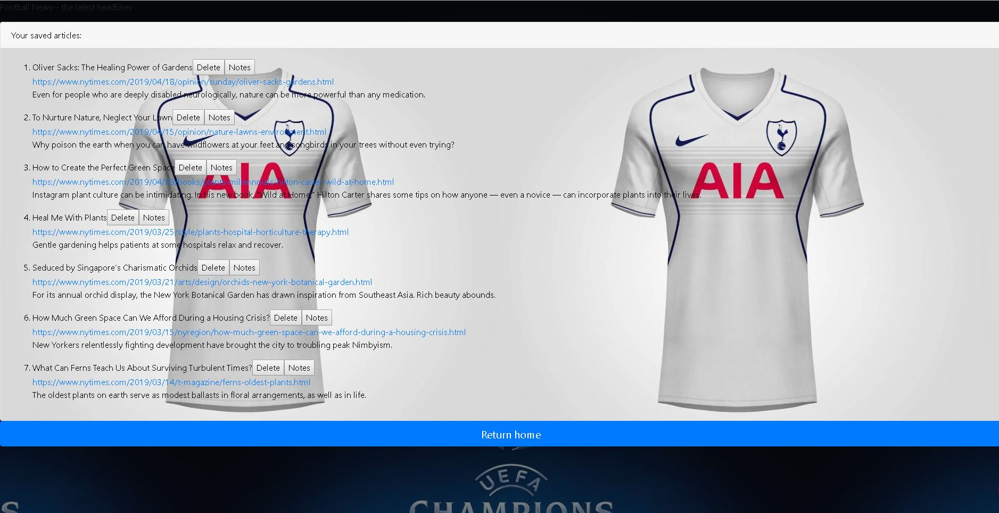

# Football News Scrapper

# The Football(scoccer) News Scapper!

# NPR News Scraper

[Live Demo herokuapp](https://footballscrapers.herokuapp.com//)

## Getting Started


1. Install dependencies
2. In your CLI, enter **mongod**
3. In a new CLI window, go to root of directory and enter **node server.js**
4. In browser, navigate to **http://localhost:3000**

### Dependencies

You will need to npm install the following node modules:

1. express
2. request
3. mongoose
4. body-parser
5. cheerio

Since I have included a package.json file, you do not need to install dependencies by name. Simply run the following in the root of your directory:

```
npm install
```


Now your project should be successfully deployed on heroku.

## Screenshots

**Article search home screen**

![screenshot-1][alt text](public/images/mainHomeSearch.png)

**Article comments modal**



